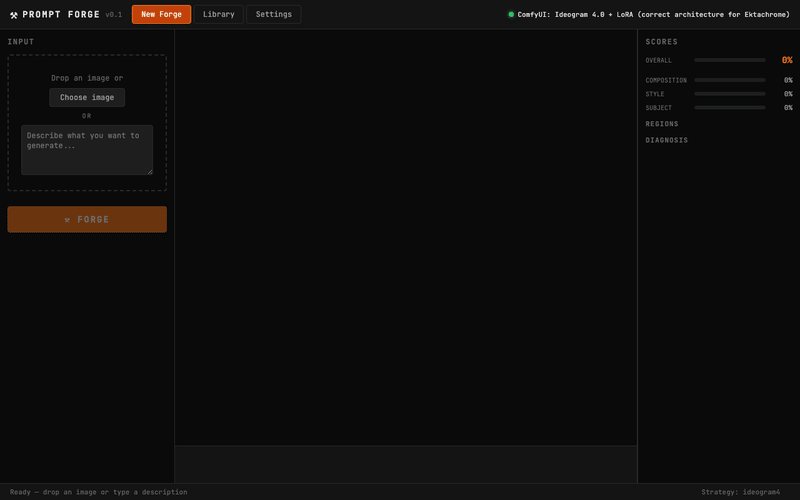

# Prompt Forge

**Type what you want → get the perfect image**

Prompt Forge is an AI image generation tool that automatically refines prompts until the output matches your description. Instead of manually tweaking prompts, you describe what you want and let the system converge on the best result.



## Quick Start

### Option 1: One-Command Install (Docker)

```bash
git clone https://github.com/jmanhype/prompt-forge
cd prompt-forge
docker-compose up
```

Then open http://localhost:7861

**Requirements:**
- Docker & Docker Compose
- NVIDIA GPU with CUDA support (or CPU-only mode)
- 24GB+ VRAM recommended (runs on 16GB with reduced quality)

### Option 2: Manual Install

```bash
git clone https://github.com/jmanhype/prompt-forge
cd prompt-forge

# Install dependencies
python -m venv venv
source venv/bin/activate  # On Windows: venv\Scripts\activate
pip install -r requirements.txt

# Start the server
python -m uvicorn server.main:app --host 0.0.0.0 --port 7861
```

**Requirements:**
- Python 3.10+
- ComfyUI running on localhost:8188 (see [ComfyUI setup](#comfyui-setup))
- Florence-2 model (auto-downloads on first run)

## How It Works

1. **Describe your image** — Type a natural language description or upload a reference image
2. **Automatic generation** — The system generates an image using Ideogram 4 + your LoRAs
3. **AI scoring** — Florence-2 analyzes the output and compares it to your description using CLIP
4. **Smart mutation** — If the score is below threshold, the system enriches the prompt and tries again
5. **Convergence** — Repeats until the image matches your description (or hits max iterations)

### Example

**Input:** "ektachrome vintage 1960s Kodak film photograph of a golden retriever sitting in an empty concrete testing facility"

**Output:** High-quality image with Ektachrome LoRA automatically injected, vintage film aesthetic, correct subject placement.

**Iterations:** 1 (converged immediately because the prompt was detailed)

**Vague prompts** like "a dog" will trigger multiple iterations as the system adds detail (lighting, camera angle, environment, etc.) until the output is compelling.

## Features

### Core
- **Closed-loop generation** — Describe → Generate → Score → Mutate → Repeat
- **Florence-2 analysis** — Captioning, object detection, OCR for reference images
- **CLIP scoring** — Calibrated piecewise normalization (65 measurements across 5 images, 13 prompts)
- **Smart mutation** — Enrichment-based (adds film grain, camera details, setting context) instead of random word swaps
- **Auto LoRA detection** — Scans ComfyUI for available LoRAs and injects matching ones (e.g., "ektachrome" → Ektachrome Style LoRA v1)

### UI
- **Dark terminal aesthetic** — Minimal, focused interface
- **Real-time updates** — WebSocket or HTTP polling fallback
- **Composition library** — Save successful generations to SQLite for reuse
- **Image upload** — Drop a reference image and let Florence-2 analyze it

## ComfyUI Setup

Prompt Forge requires ComfyUI with Ideogram 4 support.

### Install ComfyUI

```bash
git clone https://github.com/comfyanonymous/ComfyUI
cd ComfyUI
python -m venv venv
source venv/bin/activate
pip install -r requirements.txt
```

### Download Models

Download these to `ComfyUI/models/`:

- **Checkpoints:** `checkpoints/ideogram4_fp8_scaled.safetensors`
- **CLIP:** `clip/qwen3vl_8b_fp8_scaled.safetensors`
- **VAE:** `vae/flux2-vae.safetensors`
- **LoRAs:** `loras/ektachrome_style_v1.safetensors` (optional)

### Start ComfyUI

```bash
python main.py --listen 0.0.0.0 --port 8188
```

## API

### Analyze Image

```bash
curl -X POST http://localhost:7861/api/analyze \
  -F "text=ektachrome vintage photograph"
```

### Start Forge Session

```bash
curl -X POST http://localhost:7861/api/forge \
  -F "description=ektachrome vintage 1960s photograph of a dog" \
  -F "max_iterations=3"
```

Returns: `{"session_id": "abc123", "ws_url": "/ws/forge/abc123"}`

### Poll for Results

```bash
curl http://localhost:7861/api/forge/abc123
```

Returns: Full session history with iterations, scores, diagnoses, and generated images.

### WebSocket (Real-time)

```javascript
const ws = new WebSocket('ws://localhost:7861/ws/forge/abc123')
ws.onmessage = (e) => {
  const { type, data } = JSON.parse(e.data)
  if (type === 'iteration') {
    console.log(`Iteration ${data.number}: score=${data.score.overall}`)
  }
}
```

## Configuration

Create a `.env` file in the project root:

```env
# ComfyUI
COMFYUI_URL=http://localhost:8188

# Models
FLORENCE_MODEL=microsoft/Florence-2-base-ft
DEFAULT_CHECKPOINT=ideogram4_fp8_scaled.safetensors
DEFAULT_VAE=flux2-vae.safetensors

# Forge
MAX_ITERATIONS=5
CONVERGENCE_THRESHOLD=0.55

# Database
DB_PATH=data/library/compositions.db
```

## Architecture

```
server/
├── main.py              # FastAPI endpoints
├── config.py            # Environment config
├── analyzer/            # Florence-2 scene analysis
├── compiler/            # ComfyUI workflow compilation
├── connector/           # ComfyUI API client
├── scorer/              # CLIP-based scoring
├── mutator/             # Rule-based prompt enrichment
├── forge/               # Main convergence loop
├── store/               # SQLite composition library
└── lora/                # LoRA auto-detection

frontend/
├── index.html           # Single-page app
├── css/forge.css        # Dark terminal theme
└── js/                  # Vanilla JS (no build step)
```

## How It Compares

| Feature | Prompt Forge | image-to-prompt | Stable Diffusion WebUI |
|---------|--------------|-----------------|------------------------|
| **Input** | Text description or reference image | Reference image only | Text prompt |
| **Output** | Converged image | JSON prompt | Single image |
| **Automation** | Full loop (describe → generate → score → mutate) | One-shot analysis | Manual prompting |
| **Scoring** | CLIP + Florence-2 | None | None |
| **LoRA support** | Auto-detection + injection | N/A | Manual selection |
| **ComfyUI required** | Yes | No | No |

## Development

```bash
# Run tests
pytest tests/ -v

# Start with auto-reload
uvicorn server.main:app --host 0.0.0.0 --port 7861 --reload

# Format code
black server/ tests/
isort server/ tests/
```

## Roadmap

- [ ] DINOv2 per-region scoring (tell which part of the image is wrong)
- [ ] Multi-LoRA support (combine styles)
- [ ] Ideogram 4 native JSON prompting (style_description + composition fields)
- [ ] Browser-based WebSocket (currently using HTTP polling fallback)
- [ ] Image upload → forge loop (reference-based generation)
- [ ] Composition library search/retrieval
- [ ] Pinokio 1-click installer
- [ ] CPU-only mode (no GPU required)

## License

MIT

## Acknowledgments

- [Florence-2](https://huggingface.co/microsoft/Florence-2-base-ft) — Microsoft's vision-language model
- [CLIP](https://github.com/mlfoundations/open_clip) — OpenAI's contrastive image-text model
- [ComfyUI](https://github.com/comfyanonymous/ComfyUI) — Node-based Stable Diffusion GUI
- [Ideogram 4](https://ideogram.ai/) — AI image generation platform
- [Ektachrome LoRA](https://huggingface.co/jmanhype/Ektachrome-LoRA-v1-Ideogram-v4) — Vintage film aesthetic
